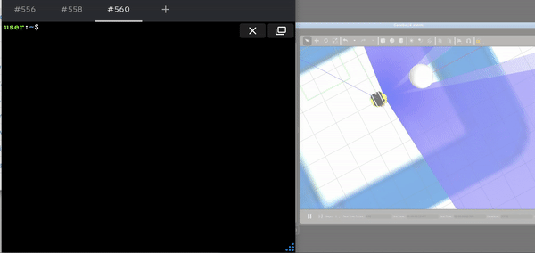
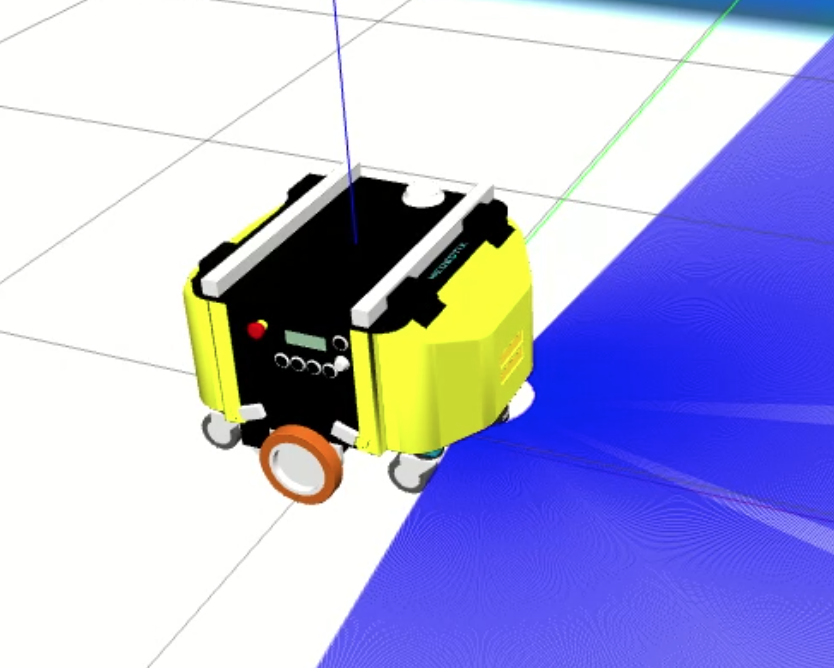

# 🚀 ROS2 C++ - The Construct Ai Course


## 📋 Course Overview

This repository showcases my completion of **The Construct's ROS2 Basics in 5 Days (C++)** course. This intensive program covers fundamental ROS2 concepts, practical implementations, and hands-on robotics programming using modern C++.

## 🎯 Course Objectives Completed

- ✅ Master ROS2 fundamental concepts and architecture
- ✅ Implement C++ nodes for robotics applications
- ✅ Work with ROS2 Topics, Services, and Actions
- ✅ Handle executors and callback groups
- ✅ Debug ROS2 applications effectively
- ✅ Implement node composition patterns
- ✅ Real robot simulation and control

## 📚 Course Modules

### 1. 🌟 Introduction to ROS2


- ROS2 architecture fundamentals
- Setting up development environment
- C++ in robotics context

### 2. 🏗️ Basic Concepts


- ROS2 nodes and their lifecycle
- Package structure and CMake
- Basic C++ node implementation
- Publisher/Subscriber patterns

### 3. 📡 ROS2 Topics


- Understanding ROS2 communication paradigm
- Creating publishers and subscribers in C++
- Message types and custom messages
- Topic remapping and configuration


### 4. ⚡ Executors & Callback Groups
- Single-threaded vs multi-threaded executors
- Callback group implementation
- Managing concurrent operations
- Performance optimization techniques

### 5. 🔧 ROS2 Services


- Request-response communication pattern
- Service client and server implementation
- Custom service definitions
- Synchronous and asynchronous service calls


### 6. 🎯 ROS2 Actions


- Long-running task management
- Action client and server architecture
- Goal, feedback, and result handling
- Preemption and cancellation


### 7. 🔍 ROS2 Debugging Tools


- ROS2 command-line tools
- RViz2 for visualization
- Debugging techniques and best practices
- Performance profiling

### 8. 🧩 Node Composition


- Component-based architecture
- Intra-process communication
- Dynamic node composition
- Performance benefits and use cases

## 🤖 Robot Platforms Used

### Neobotix MP-400


Professional mobile robot platform used for:
- Navigation algorithms
- Sensor integration
- Real-world robotics applications

### TurtleBot3 Waffle


Educational robot platform for:
- Learning ROS2 fundamentals
- Algorithm development
- Simulation and testing

## 🛠️ Technologies & Tools

- **ROS2 Humble** - Latest LTS distribution
- **C++17/20** - Modern C++ standards
- **CMake** - Build system
- **Gazebo** - 3D robot simulation
- **RViz2** - Visualization and debugging
- **Colcon** - Build tool for ROS2


## 📁 Course Materials Structure

```
ROS2-Course-Showcase/
├── README.md                    # This comprehensive guide
└── assets/                      # All media files
    ├── robot-demos/             # Robot demonstration GIFs
    └── logos/                   # Technology and platform logos
```

## 🎓 Key Learning Outcomes

### Technical Skills Acquired
- **ROS2 Architecture**: Deep understanding of distributed robotics systems
- **C++ Programming**: Modern C++ techniques for robotics applications
- **Communication Patterns**: Topics, Services, Actions, and Parameters
- **System Design**: Scalable and maintainable robotics software architecture
- **Debugging & Testing**: Professional development workflows
- **Real Robot Integration**: Hardware abstraction and driver development

### Practical Applications
- Autonomous navigation systems
- Robot control and teleoperation
- Sensor data processing and fusion
- Human-robot interaction interfaces
- Multi-robot coordination systems

## 🚀 Practical Demonstrations

The course included hands-on exercises with real robot behaviors:

**Robot Movement Control**: 
 

### Key Demonstrations:
- **Topic Communication**: Real-time data streaming between nodes
- **Service Calls**: Request-response patterns for robot commands
- **Action Servers**: Long-running tasks with feedback and cancellation
- **Visualization**: RViz integration for debugging and monitoring
- **Node Composition**: Efficient intra-process communication

## 🏆 Achievement Highlights

- ✅ **Hands-on Projects** - Multiple robot control implementations
- ✅ **Real Robot Experience** - Worked with professional robotics platforms
- ✅ **Modern C++** - Applied latest C++ standards in robotics context
- ✅ **Industry Standards** - Followed ROS2 best practices and conventions

## 📖 Learning Resources

### Recommended Next Steps
- Advanced ROS2 patterns and architectures
- Robot localization and mapping (SLAM)
- Computer vision integration
- Machine learning in robotics
- Real-time systems programming

### Community & Documentation
- [ROS2 Official Documentation](https://docs.ros.org/en/humble/)
- [ROS2 Tutorials](https://docs.ros.org/en/humble/Tutorials.html)
- [The Construct Academy](https://www.theconstruct.ai/)

## 📊 Course Statistics

- **Duration**: 5 Days Intensive Program
- **Modules**: 8 Comprehensive Units
- **Programming Language**: C++17/20
- **Robot Platforms**: 2 Different Systems
- **Hands-on Projects**: 15+ Practical Exercises
- **Certification**: ROS2 Humble C++ Certificate

## 🎯 Skills Demonstrated

### Programming Concepts
```cpp
// Example skills covered:
- Modern C++ (C++17/20)
- Object-oriented design
- Template programming
- Memory management
- Concurrent programming
- Error handling
```

### ROS2 Concepts
```bash
# Command-line tools mastered:
ros2 run <package> <executable>
ros2 topic list/echo/pub
ros2 service list/call
ros2 action list/send_goal
ros2 node list/info
colcon build --symlink-install
```

## 🔗 Connect & Collaborate

This repository demonstrates my commitment to mastering modern robotics development using ROS2 and C++. The skills acquired through this course provide a solid foundation for developing sophisticated autonomous systems and contributing to the robotics community.

### Portfolio Highlights
- **Systematic Learning**: Completed comprehensive robotics curriculum
- **Practical Experience**: Hands-on work with real robot platforms
- **Modern Standards**: Up-to-date with latest ROS2 and C++ practices
- **Professional Development**: Industry-standard tools and workflows

---

**Course Provider**: [The Construct](https://www.theconstruct.ai/)  
**ROS2 Distribution**: Humble Hawksbill  
**Completion Date**: 2025  
**Certificate**: ROS2 Basics in 5 Days (C++)

*Ready to contribute to robotics projects and continue advancing in autonomous systems development!* 🤖✨
